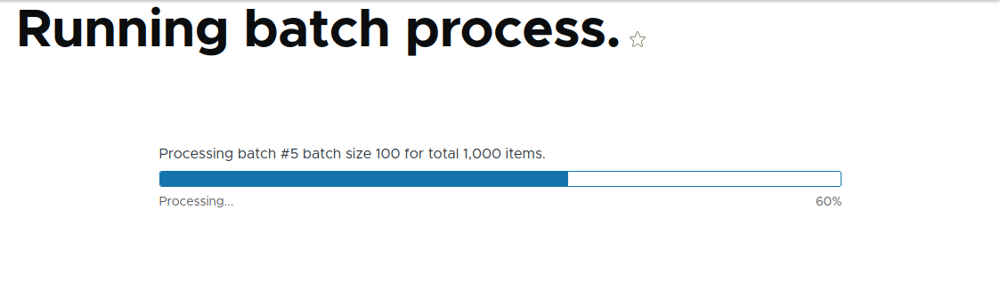
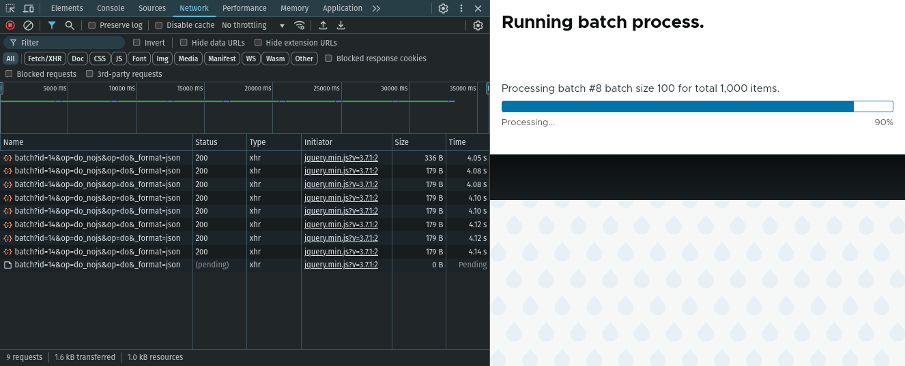

# The Drupal Batch API
<p class="centre">Philip Norton<br>
<small>DrupalCamp Scotland 2024</small></p>
<!-- Speaker notes will appear here. -->

---

# Philip Norton
- Developer at Code Enigma
- Writer at `#! code` (www.hashbangcode.com)
- NWDUG host


---

## Source Code
- This presentation:
<small>https://github.com/hashbangcode/drupal-batch-api-talk</small>
- All code seen here is available:
<small>https://github.com/hashbangcode/drupal_batch_examples</small>
- I have also written extensively about the Batch API on <small>https://www.hashbangcode.com/</small>

---

# The Drupal Batch API

<!--
The Drupal Batch API is a system that allows us to split up large tasks into smaller chunks so that we don't overload the web server. This is a really important concept to understand if you are developing your own Drupal modules, especially if you want to allow users to perform actions on lots of items at once.
In this session we will look at why we need the Drupal Batch API and how it prevents issues. We'll then do a dive into the code surrounding the Batch API and how to run your own batch operations.
There will be a few demos on running the Batch API to perform some simple tasks.
Finally, we'll look at how Drupal uses the Batch API internally and some use cases of the Batch API in contributed modules.
-->
---

## The Batch API
Allows data to be processed in small chunks in order to prevent timeout errors or memory problems.

---

# What Problem Are We Solving?

---

## Bored Users
- Users get bored quickly.
- Studies show that a 5 second page load has a 0.6% conversion rate.
- Reducing this to 2 seconds doubes the conversion rate.
- This still means that after 2 seconds 98% of users will assume the page will not do anything.


<!--
Source: https://www.cloudflare.com/learning/performance/more/website-performance-conversion-rates/
-->

---

## Server Timeouts

- Servers are designed to throw errors is something takes too long. Some defaults:

  - PHP (`max_execution_time`) - 30 seconds
  - PHP (`memory_limit`) - 256MB (recommended for Drupal)
  - Apache (`TimeOut`) - 60 seconds
  - Nginx (`send_timeout`/`proxy_send_timeout`) - 60 seconds

<!--
- You can override all these options.
- But, setting them high would cause problems on your web server.
- Think about how long a page request should take in you web server.
2-5 seconds MAX!
- The more resources you give to these services, the users you can accommodate at once.
-->

---

## The Problem

- Trying to do too much in one page request.
  - Downloading lots of data from an api.
  - Create/update/delete lots of entities.
<br>
- Users assume page is broken and click away.
- The page times out or runs out of memory.

---
<!-- _footer: "" -->
## The Batch API

- Solves these problems by splitting long tasks into smaller chunks.
- Drupal then runs them through a special interface.



---

# The Batch API

---

## The Batch API Stages

The Batch API can be thought of as the following stages:

- <strong>Initialise</strong> - Set up the batch run, define callbacks.
- <strong>Process</strong> - The batch process operations.
- <strong>Finish</strong> - A finish callback.

---

## Initialise

The BatchBuilder class is used to setup the batch.

```php
use Drupal\Core\Batch\BatchBuilder;
$batch = new BatchBuilder();
```

---
## Initialise

A number of methods set up different parameters.

```php
$batch = new BatchBuilder();
$batch->setTitle('Running batch process.')
  ->setFinishCallback([self::class, 'batchFinished'])
  ->setInitMessage('Commencing')
  ->setProgressMessage('Processing...')
  ->setErrorMessage('An error occurred during processing.');
```

---
## Initialise - Adding Operations

Populate the operations we want to perform.

```php
// Create 10 chunks of 100 items.
$chunks = array_chunk(range(1, 1000), 100);

// Process each chunk in the array.
foreach ($chunks as $id => $chunk) {
  $args = [
    $id,
    $chunk,
  ];
  $batch->addOperation([BatchClass::class, 'batchProcess'], $args);
}
```
<!-- 
- You can add multiple operations to perform different tasks.
-->
---

## Initialise - Start Batch Run

- Set the batch running by calling `toArray()` and passing the array to `batch_set()`.

```php
batch_set($batch->toArray());
```

- The whole purpose of `BatchBuilder` is to generate that array.
- This will trigger and start up the batch process.
<!--
- This will redirect to the batch processor interface and call the process operations.
- Yes you can also just define the array and send it to batch_set(), but I find BatchBuilder a nicer interface.
- This is how Drupal uses the batch system internally.
-->

---
<!-- _footer: "" -->
## Process

- The callbacks defined in the `addOperation()` method are called.
- Parameters are the array of arguments you set.
- `$context` is passed as the last parameter is used to track progress.

```php
public static function batchProcess(int $batchId, array $chunk, array &$context): void {
}
```

---
<!-- _footer: "" -->
## Process - Tracking Progress

- The `$context` parameter is an array that is maintained between different batch calls.
- The `"sandbox"` element is used inside the batch process and is deleted at the end of the batch run.
- The `"results"` element is will be passed to the finished callback and is often used to track progres for reporting.

```php
public static function batchProcess(int $batchId, array $chunk, array &$context): void {
    if (!isset($context['sandbox']['progress'])) { }
    if (!isset($context['results']['updated'])) { }
}
```
---

## Process - Tracking Progress

- Some sensible defaults.

```php
public static function batchProcess(int $batchId, array $chunk, array &$context): void {
  if (!isset($context['sandbox']['progress'])) {
    $context['sandbox']['progress'] = 0;
    $context['sandbox']['max'] = 1000;
  }
  if (!isset($context['results']['updated'])) {
    $context['results']['updated'] = 0;
    $context['results']['skipped'] = 0;
    $context['results']['failed'] = 0;
    $context['results']['progress'] = 0;
    $context['results']['process'] = 'Form batch completed';
  }

}
```
<!--
- Remember that the sandbox is thrown away once the batch has completed.
- That's why we have progress in results and in sandbox.
-->

---

## Process - Messages

- As the batch runs you can set a `"message"` element to print messages to the user.
- This will appaer above the batch progress bar as the batch progresses.

```php
// Message above progress bar.
$context['message'] = t('Processing batch #@batch_id batch size @batch_size for total @count items.', [
  '@batch_id' => number_format($batchId),
  '@batch_size' => number_format(count($chunk)),
  '@count' => number_format($context['sandbox']['max']),
]);
```
---

## Process

- Perform the task you want in the batch.

```php
public static function batchProcess(int $batchId, array $chunk, array &$context): void {
  // --- Set up and messages goes here...
  $random = new Random();
  foreach ($chunk as $number) {
    $context['results']['progress']++;
    $node = Node::create([
      'type' => 'article',
      'title' => $random->name(15),
      'body' => [
        'value' => '<p>' . $random->sentences(2) . '</p>', 'format' => filter_default_format(),
      ],
      'uid' => 1,
      'status' => 1,
    ]);
    $node->save();
  }
}
```
<!-- 
- This creates 1,000 nodes based on the chunks of 100 items from the setup.
-->
---

## Finish - The Finished Callback

- When the batch finishes the finished callback is triggered.
- This has a set of parameters that detail how the batch performed.

```php
public static function batchFinished(
  bool $success, 
  array $results,
  array $operations,
  string $elapsed): void {
}
```
<!--
- $success - TRUE if all batch API tasks were completed successfully.
- $results - An results array from the batch processing operations.
- $operations - A list of the operations that had not been completed.
- $elapsed - Batch.inc kindly provides the elapsed processing time in seconds.
-->
---

## Finished - The Finished Callback

For example, you might want to report the results of the batch run to your user.

```php
  public static function batchFinished(bool $success, array $results, array $operations, string $elapsed): void {
    $messenger = \Drupal::messenger();
    if ($success) {
      $messenger->addMessage(t('@process processed @count, skipped @skipped, updated @updated, failed @failed in @elapsed.', [
        '@process' => $results['process'],
        '@count' => $results['progress'],
        '@skipped' => $results['skipped'],
        '@updated' => $results['updated'],
        '@failed' => $results['failed'],
        '@elapsed' => $elapsed,
      ]));
    }
}
```

---

<!-- _footer: "" -->
## The Running Batch



<!-- 
- This handles the processing of the batch operations.
- JavaScript calls the /batch endpoint.
- This then responds with the result of a batch run.
- You still need to keep each individual process operation small.
-->

---

## Batch Internal Workings

- The Batch API is really an extension of the Queue system.
- When you add operations to the batch you are adding items to the queue.
- The Drupal batch runner then pulls items out of the queue and feeds them to the process.

---

# The Batch "finished" State

---

## The Batch "finished" State

- So far, we have looked at pre-confgured batch runs.
- A better approach is to use the `finished` property of the batch `$context` array.
- If we set this value to >= 1 then the batch process is considered finished.

```php
if (done) {
  $context['finished'] = 1;
}
```

---

## The Batch "finished" State

The setup is slightly different as we only create a single operation.

```php
$array = range(1, 1000);
$batch->addOperation([BatchClass::class, 'batchProcess'], [$array]);
```

This is run over and over until we issue the finished state.

---

## The Batch "finished" State

It is common to divide the progress by the maximum number of items.

```php
$context['finished'] = $context['sandbox']['progress'] / $context['sandbox']['max'];
```

---
<!-- _footer: "" -->
## The Batch "finished" State

This also means that we can just launch the batch with no arguments.

```php
$batch->addOperation([BatchProcessNodes::class, 'batchProcess']);
```

The `max` property is discovered in the `batchProcess()` method the first time it is run.

```php
public static function batchProcess(array &$context): void {
  if (!isset($context['sandbox']['progress'])) {
    $query = \Drupal::entityQuery('node');
    $query->accessCheck(FALSE);
    $context['sandbox']['progress'] = 0;
    $context['sandbox']['max'] = $query->count()->execute();
  }
```

---

# Running Batch With Drush

---
## Drush

Call batch set as normal.

```php
batch_set($batch->toArray());
```
Then call the Drush function.
```php
drush_backend_batch_process();
```
This will run the batch on the command line. 

---

## Drush

- Be careful! Drush will process the batch operations in the same memory space.
- As you are on the command line you won't time out, but you can run out of memory.
<!--
- You may see timeouts, it depends on your server setup.
- Generally, CLI has unlimited processing time for operations.
-->

---

# Examples Of Batch API In Action

Some live demos!

---

## Batch Using A Form
- A look at the Batch API shown above.
- Batch process goes through 1,000 items and roll a dice to determine outcome.

---

## Batch Using Drush
- Batch process goes through 1,000 items and roll a dice to determine outcome.
- This time, in Drush!

---

## Process a CSV file
- Import 1,000 nodes using a batch process.
- This uses the `finished` property to track progress of the CSV and stop the batch when needed.

---

# The Batch API Inside Drupal

---

## The Update Hook

- Update hooks get a `$sandbox` variable. This is actually a batch `$context` array.
- You can set the `#finished` property in the `$sandbox` array to stop the batch.
<!--
- Update hooks are hook_update_N() and hook_post_update_NAME().
- Note the has in the finished property.
-->

---
<!-- _footer: "" -->
## The Update Hook
An example of a batched update hook.
```php
function batch_update_example_update_10001(&$sandbox) {
  if (!isset($sandbox['progress'])) {
    $sandbox['progress'] = 0;
    $sandbox['max'] = 1000;
  }

  for ($i = 0; $i < 100; $i++) {
    // Keep track of progress.
    $sandbox['progress']++;
    // Do some actions...
  }
  \Drupal::messenger()->addMessage($sandbox['progress'] . ' items processed.');

  $sandbox['#finished'] = $sandbox['progress'] / $sandbox['max'];
}
```

---

## Batch API In Drupal

- Drupal also makes use of the Batch API in lots of different situations. For example:
  - Installing Drupal.
  - Installing modules.
  - Importing translations.
  - Importing configuration.
  - Deleting users.
  - Bulk content updates.
  - And much more!
<!--
- Look for the progress bar. This will mean you are running the Batch API to perform the work.
-->
---

# Some Tips On Batch API Usage

---

## When To Use The Batch API

- If the request processes items them move it into a batch.
- Users will more readily wait for a batch to finish than a spinning page.
- Use the batch system early to save having to rework things later.

---

<!-- _footer: "" -->

## Top Tips

- If the data needs to be processed in real time then use a batch; otherwise use a standard queue.
- Kick off your batches in a form or controller, but process the batch in a separate class. This allows easy Drush integration.
- Use the `finished` property to make dynamic batches; rather than preloaded.

---

## Top Tips

- Keep your batch operations simple. Break them apart into separate operations if needed.
- Think about the footprint of your batch operations. Keep them small. You can still cause timeouts during the batch if you aren't careful.
- Try to allow batch operations to pick up where they left off. If any errors occur you can re-run to complete the task.

---

# Modules That Use Batch

---

## View Batch Operation

- Batch process items in a view.

<small>https://www.drupal.org/project/views_bulk_operations</small>

---

## Advanced Queue

- Shows a breakdown of the current queues in your system.
- Gives the option to process queues as a batch run.

<small>https://www.drupal.org/project/advancedqueue</small>

---

## Views Data Export

- A Views plugin that exports data in a number of different formats.

<small>https://www.drupal.org/project/views_data_export</small>

---

## Batch Plugin

- Wraps the Batch API in a plugin to make your batch operations pluggable.

<small>https://www.drupal.org/project/batch_plugin</small>

---

## Resources

- [Drupal 11: An Introduction To Batch Processing With The Batch API](https://www.hashbangcode.com/article/drupal-11-introduction-batch-processing-batch-api)
- [Drupal 11: Batch Processing Using Drush](https://www.hashbangcode.com/article/drupal-11-batch-processing-using-drush)
- [Drupal 11: Using The Finished State In Batch Processing](https://www.hashbangcode.com/article/drupal-11-using-finished-state-batch-processing)
- [Drupal 11: Using The Batch API To Process CSV Files](https://www.hashbangcode.com/article/drupal-11-using-batch-api-process-csv-files)
- [Drupal Batch Examples source code](https://github.com/hashbangcode/drupal_batch_examples/)

---

## Questions?

- Slides: https://github.com/hashbangcode/drupal-batch-api-talk


---

## Thanks!

- Slides: https://github.com/hashbangcode/drupal-batch-api-talk


